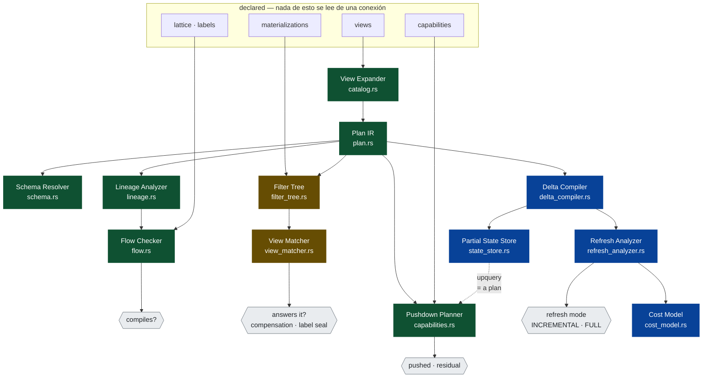

# Handoff · el motor de vistas

> **Este documento es desechable.** Se borra el día que M6 esté en verde o se declare fuera de
> alcance por escrito. Un plan que sobrevive a su ejecución deja de ser un plan.
>
> Fecha: 2026-09-01 · Derivado de lo que publican Apache Calcite, Substrait, Feldera/DBSP,
> Trino, OpenLineage, Snowflake, Palantir Foundry y Cognite Data Fusion.
>
> **La pieza se diseña libre.** Nada de aquí está condicionado por lo que hoy hay en el árbol.
> Lo que esta pieza le hará a las reglas actuales está en §7, **al final y a propósito**, para
> que se decida a sabiendas y no para que decida el diseño.

---

## 1. Qué es un motor de vistas, técnicamente

Los siete jugadores tienen **los mismos siete órganos**. No se parecen: son el mismo animal.

| | Órgano | Qué hace | Quién lo tiene canónico |
|---|---|---|---|
| **1** | **catálogo** | definiciones versionadas con identidad | CDF (views y data models versionados; containers no) |
| **2** | **IR** | álgebra relacional serializable | **Substrait** · `RelNode` de Calcite |
| **3** | **expansor y reescritor** | mete las vistas en el plan; contesta desde materializaciones | **Calcite** |
| **4** | **capacidades y empuje** | qué sabe hacer el origen, qué queda de residuo | **Trino**, SPI de conector |
| **5** | **ejecución del residuo** | correr lo que el origen no pudo | Velox · DataFusion · DuckDB |
| **6** | **mantenimiento incremental** | mantener lo materializado al día en O(Δ) | **DBSP/Feldera** |
| **7** | **linaje a nivel de columna** | qué columna raíz produce qué columna de salida | **OpenLineage** |

Y ahora el corte que importa:

> **Los órganos 1, 3, 4 y 7 son metadatos. Los órganos 2, 5 y 6 son cómputo — salvo que el 2
> es metadato *sobre* cómputo, y es el que desbloquea a los otros tres.**

De ahí la naturaleza de la pieza, dicha en una línea:

> **Un motor de vistas es un compilador de álgebra relacional con un catálogo versionado, un
> modelo de capacidades y un reescritor. La ejecución es de otro.**

No es una opinión: es la descripción literal de **Apache Calcite**, que no tiene ni
almacenamiento ni ejecución y es el motor de vistas de media industria; y de **Substrait**, que
es una especificación sin motor. Los dos artefactos más usados de esta categoría **no ejecutan
nada**.

---

## 2. El IR es la pieza

Todo lo demás cuelga del órgano 2. Sin un plan que se pueda mirar no hay reescritura, no hay
linaje derivado, no hay empuje y no hay incremental — solo hay cadenas de SQL.

**Substrait** es la respuesta publicada: especificación en protobuf de álgebra relacional,
*«SQL es el lenguaje de consulta para humanos; Substrait es lo que los motores intercambian»*.
La adoptan DuckDB, Apache DataFusion, Velox e Ibis, y permite que **un trozo del plan lo
ejecute un motor y otro trozo otro**, con la frontera expresada en Substrait.

Dos decisiones que hay que tomar y **no están tomadas**:

**¿IR propio o Substrait?** Propio es más simple y encaja con una forma canónica que ya sabemos
hacer determinista. Substrait da portabilidad real a tres motores el primer día. La respuesta
probable es **IR propio con emisión a Substrait**, por la misma razón por la que emitimos a
Cedar y a ODCS sin ser ninguno de los dos.

**¿Hasta dónde llega el álgebra?** Cuanto más expresiva, menos analizable. La expresividad
acotada es lo que hace posible §4. Punto de partida honesto: `Scan`, `Project`, `Filter`,
`Join`, `Aggregate`, `Union`, `Distinct`, `Limit`. Sin recursión, sin ventanas, sin UDF. Lo que
no quepa entra como **expresión opaca declarada**, que cuesta la garantía de análisis y **aun
así declara entradas y salidas** para que las etiquetas fluyan de forma conservadora.

---

## 3. Los tres problemas duros, con su estado del arte real

Ninguno está resuelto del todo por nadie. Conviene saberlo antes de prometer.

### 3.1 · Contestar una consulta desde una materialización

Calcite tiene **tres** implementaciones, lo cual ya dice algo:

- **`SubstitutionVisitor`** — sustituye un trozo del árbol por la materialización, añadiendo un
  predicado residual si hace falta. Y la documentación admite el límite: *«podría necesitar
  enumerar exhaustivamente todas las reescrituras equivalentes posibles, lo que no es escalable
  con vistas complejas, p. ej. vistas con un número arbitrario de joins»*.
- **Retículos y *tiles*** — eficiente cuando las fuentes forman un esquema en estrella.
- **`MaterializedViewRule`**, sobre Goldstein–Larson — cadenas arbitrarias de `Join`, `Filter`,
  `Project`, y `Aggregate` con *roll-up*.

> **Nuestro `cache::consultar` de hoy es el peldaño 0 de esta escalera**: coincidencia exacta de
> entidad más contención de propiedades. No es poco riguroso: es el subconjunto decidible, y lo
> honesto es decir que lo es.

### 3.2 · Mantenimiento incremental

**DBSP** es la respuesta, y es teoría publicada (VLDB'23, VLDB Journal 2025), no un producto con
folleto:

- **Z-sets**: cada fila lleva un **peso**, y el peso puede ser negativo. Con eso, inserciones y
  borrados se tratan **uniformemente**, que es lo que hace que el incremental funcione para
  *cualquier* mezcla de cambios y no solo para *appends*.
- Cubre álgebra relacional completa, conjuntos y multiconjuntos, anidamiento, agregación,
  *flatmap*, recursión monótona y no monótona, y composiciones arbitrarias de todo eso.
- El coste escala con **el tamaño del cambio**, O(Δ), no con el de la tabla.

Es lo que convierte *«las ontologías nacen, crecen y se reproducen en tiempo real»* de premisa
en mecanismo. Y Feldera está escrito en Rust, lo cual no es un detalle menor.

El contraste con la alternativa comercial: las *dynamic tables* de Snowflake son declarativas
—`TARGET_LAG`, mínimo 60 s— y refrescan incrementalmente coordinando el orden de dependencias.
Es DBSP con menos ambición y un SLA declarado.

### 3.3 · Negociación de capacidades

Trino la hace **por intento**: el optimizador llama a `applyFilter`, `applyProjection`,
`applyAggregation`, `applyJoin`, `applyLimit`, `applyTopN`, `applyTableScanRedirect`, y el
conector devuelve `Optional.empty()` si no puede. Se llaman **varias veces** por consulta, y es
crítico devolver vacío cuando la llamada no tuvo efecto **o el optimizador entra en bucle**.

Nosotros lo haríamos **por declaración** —`capabilities:` en la vista—. Las dos son legítimas y
tienen precios opuestos:

| | Ventaja | Precio |
|---|---|---|
| **por intento** | exacto: refleja lo que el conector hace de verdad | necesita el conector delante; no se puede planificar sin conexión |
| **por declaración** | **se rechaza un plan sin abrir una conexión** | la declaración puede mentir |

La resolución honesta: **declarar, y dejar que el driver contradiga.** Una capacidad declarada
que el driver rechaza es una divergencia con nombre, no un fallo en ejecución.

---

## 4. Dónde está la diferencia, y sale de OpenLineage

El único órgano donde no hay competencia es el 7 cruzado con una clasificación.

OpenLineage ya modela el linaje de columna con una precisión que nadie usa para gobernar. Su
`ColumnLineageDatasetFacet` distingue:

- **`DIRECT`** — el valor de la columna de salida se derivó del de la columna de entrada.
- **`INDIRECT`** — el valor de la salida **está influido** por la entrada **sin derivarse de
  ella**. Subtipos: `GROUP_BY`, `FILTER`, `SORT`.

Y cada transformación lleva un campo **`masking`**.

Léelo con ojos de control de flujo de información: **`INDIRECT` es un flujo implícito.** Una
columna que solo aparece en un `WHERE` no sale en el resultado y **decide qué filas salen**. Si
esa columna es `gdpr.sensitivity: critical`, filtrar por ella filtra información crítica hacia
un resultado que nadie clasificó.

> **El retículo tiene que fluir también por las aristas `INDIRECT`, o filtrar por una columna
> crítica es una fuga que el linaje ve y nadie mira.**

OpenLineage lo **registra**. Foundry propaga *markings* pero por dataset y los aplica al
acceder. dbt no sabe qué es una etiqueta. **Nadie se niega a compilar.** Ahí está la pieza que
justifica construir esto en vez de comprarlo.

---

## 5. La superficie

Lo que un motor de vistas de nivel industria **expone**, antes de decidir dónde vive:

| Superficie | Verbo | Qué contesta |
|---|---|---|
| **catálogo** | `registrar`, `listar`, `versión` | qué vistas hay y cuál es esta |
| **plan** | `planificar(vista \| consulta) → plan` | qué se va a hacer, sin hacerlo |
| **linaje** | `linaje(vista) → facet` | qué columna raíz produce qué salida, y por qué arista |
| **gobierno** | `comprobar(vista) → diagnósticos` | por qué esto no compila |
| **empuje** | `repartir(plan, capacidades) → (empujado, residuo)` | qué hace el origen y qué queda |
| **refresco** | `delta(vista, desde) → plan` | qué hay que recomputar y nada más |

Las cuatro primeras **no necesitan ninguna conexión**. Es la misma propiedad que ya se
demuestra hoy con el plan, un piso más abajo.

---

## 6. Los peldaños

> **Desde aquí es desechable.**

### M0 · El IR ✅

`crates/ore-view` — `Lee`, `Proyecta`, `Filtra`, `Une`, `Agrupa`, `Unifica`, `Distingue`,
`Limita`, y la expresión opaca declarada. Forma canónica RFC 8785 —**la del bundle**, no una
segunda— y digest `sha256:` con separación de dominio `OREPLAN1`.

**Listo cuando:** dos escrituras del mismo plan dan el mismo digest, el plan va y vuelve, y un
plan con una expresión opaca **dice que lo es**. ✅ · 19 comprobaciones.

Cuatro cosas que salieron de construirlo y no estaban previstas:

**El digest es del significado, no de la escritura.** La forma canónica reordena lo conmutativo
—operandos de `Y` y `O`, ramas de `Unifica`, columnas de una proyección, pares de una junta— y
deduplica. Lo que **no** se conmuta son los lados de una junta: en una externa no son
conmutables, y tener dos reglas según el tipo de junta sería peor que no tener ninguna.

**La vuelta no reconstruye la escritura: reconstruye la forma canónica.** Lo dijo ejecutarlo. Es
lo correcto, y lo que hay que exigir es lo otro — que **leer la forma canónica sea un punto
fijo**, y eso tiene su comprobación.

**No hay literal `Float`.** `OOS6003` prohíbe los decimales sin comillas para que la forma
canónica no serialice nunca una coma flotante; aquí es la misma regla. Un decimal lleva sus
dígitos tal cual, y comparar contra un campo `Float` no cabe en v1. Mejor que no quepa a que
quepa dando un digest distinto por máquina.

**El tipado caza cuatro cosas que en un almacén no fallan hasta ejecutar** — y una de ellas no
falla nunca: juntar dos tablas con una columna del mismo nombre, unir dos ramas que no producen
lo mismo, **comparar tipos que solo se comparan por conversión implícita** —que no da un error,
da cifras incorrectas— y una expresión opaca que declara leer una columna que no existe. Esa
última es el único control que una opaca tiene, y por eso no se puede saltar: si su superficie
declarada miente, las etiquetas dejan de fluir por donde de verdad pasan.

De paso, `ore_core::types::Type` no se podía escribir de vuelta: había `parse_type` y no había
`Display`. Ahora lo hay, con la invariante `parse_type(t.to_string()) == t` ejercida sobre el
conjunto cerrado entero.

### M1 · El expansor ✅

`catalog.rs`. Una vista es **un nombre y un cuerpo**, y el cuerpo es un plan cuyas hojas pueden
ser lecturas de una fuente **o [`Nodo::Referencia`] a otra vista**. Expandir es sustituirlas
hasta que no queda ninguna.

**Listo cuando:** una cadena de N vistas produce **un** plan, y un ciclo se rechaza nombrando
las vistas que lo forman. ✅ · `ciclo entre vistas · a → b → c → a`

Tres cosas de construirlo:

**La referencia no es una rareza: es una exploración con otro nombre.** Un `TableScan` de
Calcite se apoya en una tabla que puede ser una vista, y el `ReadRel` de Substrait admite una
`NamedTable`. Con eso, componer no necesita un concepto nuevo — y **no hace falta «pipeline»**.

**El compilador señaló una decisión que no estaba tomada.** Al añadir la referencia, el tipado
dejó de ser exhaustivo, y la respuesta correcta no era «trátala como una hoja vacía»: un plan
sin expandir **no se puede tipar**, porque un esquema sobre medio plan parece bueno. Es
`Desajuste::SinExpandir`, y tiene prueba.

**El camino, no un conjunto de visitados.** Es el error clásico: con un `visitados` global, un
**rombo** —dos vistas apoyadas en una tercera— se confunde con un ciclo, y la primera persona
que reutilizara una vista limpia en dos sitios se encontraría un ciclo que no existe. Hay una
comprobación que falla si alguien lo cambia.

Y dos límites que salen por su nombre en vez de producir algo raro: **incorporar duplica** —una
vista referenciada dos veces se copia dos veces, y lo que lo arregla es M5, no un parche aquí— y
**no hay alias**, así que dos referencias a la misma vista chocan por nombre de columna y lo
dice `ColisionAlUnir`.

### M2 · El linaje, derivado del plan ✅

`lineage.rs`. Calculado del IR, no observado de una ejecución, así que existe antes de que nadie
abra nada. Vocabulario de OpenLineage tal cual —`DIRECT` con `IDENTITY`/`TRANSFORMATION`/
`AGGREGATION`, `INDIRECT` con `JOIN`/`GROUP_BY`/`FILTER`— y emisión del facet `columnLineage`.

**Listo cuando:** cada campo de salida nombra sus campos raíz, y **un campo que solo aparece en
un filtro sale como `INDIRECT`**. ✅ · 39 comprobaciones en el crate.

**La regla de composición es una y es la que hace que la influencia no se pierda:**

> **Derivar es transitivo solo a través de derivaciones. Si cualquiera de los dos pasos es
> influencia, el resultado es influencia.**

Sin ella, proyectar después de filtrar borraría el flujo implícito — y el análisis parecería más
limpio justo donde deja de ser cierto. Hay una prueba con cuatro proyecciones apiladas sobre un
filtro.

Cuatro decisiones que salieron de escribirlo:

| | |
|---|---|
| **`DIRECT` e `INDIRECT` son familias, no un enum plano** | `DIRECT` con subtipo `FILTER` no significa nada, y un enum plano lo dejaría escribir |
| **`Distingue` produce `GROUP_BY`** | quitar duplicados **es** agrupar por todas las columnas, que es como lo reescribe cualquier planificador |
| **`Limita` no inventa aristas** | sin orden, qué filas sobreviven no lo decide ninguna columna. `SORT` llegará con el nodo de orden |
| **`cuenta` sin columna no queda huérfana** | no deriva de ninguna, y aun así su valor lo decide qué filas caen en el grupo: sale por las aristas de agrupación |

Y la opaca sigue pagando su precio y cumpliendo su parte: **su `lee` declarado entra en el
linaje**, así que un trozo que nadie entiende sigue dejando fluir las etiquetas de forma
conservadora.

Dos cosas del facet que **no** se emiten, con su razón: `masking` —saber si algo enmascara es un
juicio de gobierno, y aquí no hay retículo: es de M3— y el array `dataset` de dependencias
indirectas de todo el conjunto —es una compactación, y tener el mismo hecho en dos sitios es lo
que este proyecto no hace—.

### M3 · El retículo fluye por el linaje, y se niega a compilar ✅

`flow.rs`. **El peldaño que vale dinero:** todo lo anterior lo tienen otros.

**Listo cuando:** una vista que expone por debajo de la clasificación de una entrada no
compila, **y el caso `INDIRECT` falla igual**. ✅ · 52 comprobaciones en el crate.

```text
`cuanto` no compila
  ← lago·ventas.pedidos.nif  por INFLUENCIA (Filtro)
  gdpr.sensitivity del origen    : critical
  gdpr.sensitivity de esta vista : medium
```

`nif` **no sale** en el resultado: solo se filtra por él. En control de flujo de información eso
es un **flujo implícito**, y el tratamiento clásico —Denning— es que la etiqueta de la condición
se une a todo lo que se computa bajo ella. Aquí es literal: una arista `INDIRECTO` clasifica
igual que una `DIRECTO`.

Se podría argumentar que un flujo implícito filtra *menos*. **No tenemos el argumento
cuantitativo**, y aflojar sin él sería aflojar por comodidad en la dirección insegura. Lo que
hace vivible la regla estricta no es relajarla: es **desclasificar explícitamente**, que es lo
que una máscara de `Ruleset` ya hace en OOS.

**Y hay una cosa que no habría acertado solo**, que estaba escrita en `ore_core::flow::Axis`
desde antes que esta pieza:

| Eje | Pregunta | Combina | Viola si |
|---|---|---|---|
| **confidencialidad** | *¿cuánto daño si esto se filtra?* | `max` | la salida sale **por encima** de lo autorizado |
| **integridad** | *¿cuánto daño si esto es falso?* | `min` | la salida queda **por debajo** de lo exigido |

Con `max` en los dos, una vista que junta un dato fiable con uno dudoso **parecería fiable**.
Por eso el retículo se reutiliza entero en vez de redefinirlo: la regla ya estaba escrita, y una
segunda copia habría divergido justo aquí. Hay una prueba que pasa **el mismo par de etiquetas**
por los dos ejes y comprueba que salen al revés.

Tres decisiones más, todas en la dirección de no callar:

| | |
|---|---|
| **una raíz sin etiqueta no participa** | no es el fondo ni lo más alto: es que no está. Es la convención del compilador, y otra aquí clasificaría la misma columna distinto según quién pregunte |
| **un nivel mal escrito no es «estar por debajo»** | confundirlos convertiría una errata en una columna que parece limpia |
| **se dicen todas las fugas y todos los culpables** | un compilador que informa de un error cada vez se ejecuta diez veces; y arreglar una raíz dejando la otra no arregla nada |

Y una medida del propio trabajo: **el tipador de M0 rechazó tres de mis fixtures** por comparar
`Decimal` con `Integer`. Tenía razón.

### M4 · Capacidades y reparto ✅

`capabilities.rs`. `(empujado, residuo)` a partir de las capacidades declaradas.

**Listo cuando:** un plan contra un origen con `fullScan: forbidden` y sin claves se rechaza
**sin abrir una conexión**, y uno con `predicatePushdown: [eq]` empuja el `eq` y deja el resto
de residuo, **diciendo cuál es el residuo**. ✅ · 67 comprobaciones en el crate.

Es lo que convierte un escaneo en una búsqueda por clave — el argumento entero del ADR 0006. Un
predicado se aplana en conyuntos y baja hasta la hoja, **y cada nodo por el que pasa tiene su
regla y su motivo**:

| | Qué baja | Por qué |
|---|---|---|
| **proyección** | lo que nombra columnas copiadas tal cual | reescribir un predicado sobre algo computado es donde un optimizador se equivoca en silencio |
| **junta** | cada conyunto al lado que tiene sus columnas | el que cruza los dos lados cambiaría el resultado si bajara a uno |
| **grupo** | solo sobre claves de grupo | filtrar por un agregado es un `HAVING`, y por debajo del grupo no significa nada |
| **unión** | a **todas** las ramas | la propiedad distributiva, y es lo que evita traer entera la rama que no aporta |
| **límite** | **nada** | filtrar y luego limitar no es limitar y luego filtrar |

Esa última es la trampa, y está encodada con su prueba: equivocarse ahí **devuelve un resultado
plausible** — salen filas, menos de las que debían.

**Dos puertas que se cierran sin abrir nada**, que es toda la gracia de declarar en vez de
intentar: `fullScan: forbidden` sin ningún filtro bajado, y un `requiredFilters` que no llega. Y
**la ausencia de capacidades es una negativa, no una laguna** — P4 aplicada al reparto, y
`05-ejecutor` §5.1 dicho en código.

Y la escapatoria deja de ser solo cara: **una opaca se empuja si el origen habla su dialecto**.
Lo que no hace es cruzar una proyección que renombra — su texto nombra columnas por dentro y
este motor no lo lee, así que traducir solo su `lee` dejaría el texto apuntando a nombres que ya
no existen.

Dos cosas que M4 **no** hace, con su razón: **no poda columnas** —es una segunda optimización
con su propia medida, y hacerla sin medirla sería inventarla— y **no baja agregados ni juntas**,
que son las dos que más cambian el reparto y las dos que más fácil se hacen mal.

Y el aviso que quedó por escrito en la cabecera del módulo: bajar un predicado y quitarlo del
residuo **confía en la declaración**. Para un filtro cualquiera es una optimización; para uno que
restringe **qué puede ver un principal**, confiar es devolver filas de más si el origen lo
ignora. Esta pieza no sabe cuál es cuál, así que deja el predicado escrito en la `Peticion` para
que quien sí lo sepa pueda volver a aplicarlo — y cuando esto se absorba, el campo que los marca
ya existe: es el `ambito` de un filtro.

### M5 · Reescritura con materializaciones — **Filter Tree** y **View Matcher**

> **Medido en profundidad en el [Anexo](#anexo--las-piezas-que-faltan), Parte I.** Lo de aquí es el
> planteamiento; allí están las cuatro condiciones, la frontera de decidibilidad y los seis
> peldaños en que se parte.

Subconjunto honesto primero: misma exploración, contención de proyección, e **implicación de
predicados** para conjunciones de comparaciones simples. La reescritura con un número arbitrario
de joins **queda fuera**, y Calcite documenta por qué.

**Listo cuando:** un plan se contesta desde una materialización cuya proyección lo contiene y
cuyo predicado lo implica; y uno cuyo predicado **no** lo implica va al origen **con el
motivo**.

### M6 · Mantenimiento incremental — **Delta Compiler**, **Refresh Analyzer**,
### **Partial State Store** y **Cost Model**

> **Medido en profundidad en el [Anexo](#anexo--las-piezas-que-faltan), Parte II.** Allí están las reglas
> delta operador por operador, lo que no se puede incrementalizar, y las tres formas del sector
> para el problema del estado.

DBSP: Z-sets con pesos, circuitos, O(Δ).

**Listo cuando:** aplicar un delta a una vista materializada da el mismo estado que
recomputarla, sobre una secuencia generada de inserciones **y borrados** mezclados — que es
justo el caso que los modelos de solo-*append* no cubren.

### Lo que hay que decir de M5 y M6

**Son los dos peldaños de investigación.** M5 es un problema conocido y parcialmente resuelto
por el mejor planificador de código abierto que existe, y M6 es una tesis de VLDB con una
empresa detrás. Ponerlos en una lista al lado de M0 no los hace del mismo tamaño.

**M0–M4 es un motor de vistas útil y completo sin ninguno de los dos**: planifica, empuja,
deriva linaje y se niega a compilar. M5 lo hace rápido. M6 lo hace de tiempo real. **Prometer
M6 con fecha sería la clase de promesa que este proyecto no hace.**

---

## 7. Lo que esta pieza le hace a las reglas de hoy

Deliberadamente al final. No condiciona el diseño; lo paga.

**El veto de dependencias.** Substrait es protobuf, y `prost` es Rust puro: emitirlo **no** rompe
la hermeticidad. Es mejor noticia de la esperada.

**«ORE no opera ninguna base de datos».** Parecía que M6 la rompía, y **no la rompe**. El
mantenimiento incremental tiene estado —DBSP: *«ese estado vive enteramente en los operadores de
retardo»*— y la decisión de dónde ponerlo está tomada: **estado parcial en el almacenamiento del
cliente**, la forma de Noria. Lo que ORE guarda sigue siendo metadato, y **un fallo de estado es
una lectura a la fuente, que es un plan**. Está en el [Anexo](#anexo--las-piezas-que-faltan) §II.3.

**La ejecución del residuo.** O se empuja todo y se rechaza lo que no se pueda empujar
—coherente con lo que ya hacemos, y limitante—, o hace falta un motor de consulta delegado. Es
una bifurcación real y también es una decisión, no un detalle.

**El `Binding` ya estaba condenado** por `handoff-vistas.md`; esto no añade nada ahí.

---

## 8. Lo que **no** entra

**Escribir un motor de ejecución.** Los dos artefactos más usados de esta categoría no ejecutan
nada. Escribir uno sería competir donde hay tres proyectos maduros y ninguna ventaja.

**Reescritura con joins arbitrarios.** §3.1, con la cita de quien lo intentó.

**Recursión, ventanas y UDF en el álgebra de v1.** §2. Lo que no quepa entra como expresión
opaca y paga el análisis.

**Milisegundos antes de M6.** Y después de M6, solo sobre lo materializado.

---

# Anexo · las piezas que faltan

> **Desechable**, como el resto del documento. Se borra con él.
>
> Fecha: 2026-09-01 · Escrito después de cerrar M0–M4 y **antes** de tocar M5 o M6.
>
> Esto es **el plano de la máquina**: qué piezas faltan, **cómo se llama cada una**, qué
> contesta, con qué entra y con qué sale. La teoría está debajo de cada pieza, justificando su
> forma — no delante.
>
> **Las piezas se nombran en inglés y con la terminología del sector**, no con nombres propios:
> *filter tree* es de Goldstein–Larson, *view matching* es de Oracle y de Calcite, *upquery* y
> *partial state* son de Noria, *refresh mode* y *target lag* son de Snowflake, y *cost model*
> es de Databricks. Un ingeniero de datos tiene que poder leer este plano sin traducir nada.

---

## 1. La máquina entera



### 1.1 · El censo

| Pieza | Módulo | Fase | Qué contesta | |
|---|---|---|---|---|
| **Plan IR** | `plan.rs` | M0 | *qué se va a hacer*, con identidad determinista | ✅ |
| **Schema Resolver** | `schema.rs` | M0 | *qué columnas salen y de qué tipo* | ✅ |
| **View Expander** | `catalog.rs` | M1 | *una cadena de vistas es un plan* | ✅ |
| **Lineage Analyzer** | `lineage.rs` | M2 | *de qué columna raíz sale cada salida, y por qué arista* | ✅ |
| **Flow Checker** | `flow.rs` | M3 | *por qué esto no compila* | ✅ |
| **Pushdown Planner** | `capabilities.rs` | M4 | *qué hace el origen y qué queda* | ✅ |
| **Filter Tree** | `filter_tree.rs` | **M5** | *de todas las materializaciones, ¿cuáles podrían servir?* | ✅ |
| **View Matcher** | `view_matcher.rs` | **M5** | *¿esta la contesta, y con qué compensación?* | ✅ |
| **Delta Compiler** | `delta_compiler.rs` | **M6** | *cuál es el circuito Δ de este plan* | ✅ |
| **Refresh Analyzer** | `refresh_analyzer.rs` | **M6** | *`INCREMENTAL` o `FULL`, y si `FULL`, por qué* | ✅ |
| **Partial State Store** | `state_store.rs` | **M6** | *qué hay cacheado, y qué falta* | ⏳ |
| **Cost Model** | `cost_model.rs` | **M6** | *¿sale más barato incrementar o recomputar?* | ⏳ |

**Doce piezas, diez construidas.** M5 está entero; de M6 quedan el estado y el coste. Ninguna sabe qué es un paquete OOS y ninguna abre una
conexión. Es lo mismo que decían Calcite y Substrait desde el principio: **un motor de vistas es
un compilador**.

> **Los ficheros dicen lo mismo que el plano.** Los seis módulos construidos se renombraron al
> inglés el 2026-09-01 — traducción literal, sin tocar una línea de lógica— y los seis que faltan
> se llaman como su pieza. Un plano y un árbol de ficheros que no coinciden es un sitio donde
> equivocarse.

---

## Parte I · M5 · lo que lo hace **rápido**

Dos piezas: el **Filter Tree** reduce el problema, el **View Matcher** lo resuelve.

### I.1 · **Filter Tree** — `filter_tree.rs`

> **De N materializaciones a las candidatas de este plan, sin mirar ninguna por dentro.**

```text
in    plan  +  catálogo de materializaciones
out   candidatas
```

El nombre es de Goldstein–Larson (SIGMOD'01) y es la aportación suya que se cita menos, aunque
es la que decide si esto sirve en producción. Calcite reconoce por escrito que no lo tiene —*«la
regla intenta emparejar todas las vistas contra cada consulta. Planeamos implementar técnicas de
filtrado más refinadas»*—, y con mil vistas eso son mil intentos por plan.

**La firma ya existe desde M0**: `Nodo::lecturas()` da el conjunto de hojas
`(datasource, objeto)`. Una materialización solo puede servir a un plan si sus hojas están
**contenidas** en las de él. Eso es un test de subconjunto sobre un índice invertido, y quita el
99 % antes de cotejar nada.

**Listo cuando:** con mil materializaciones y un plan de dos hojas, se cotejan solo las que
tocan esas dos hojas — y hay una prueba que **cuenta cuántas se cotejan**, no cuánto tarda.
✅ · **mil registradas, cuatro cotejadas.**

**Coste:** bajo, y lo fue. La firma estaba construida y el índice es un `BTreeMap`.

Dos cosas que salieron de construirlo:

**La tabla se comprueba contra el plan al registrar.** Una materialización cuya tabla dice
producir otras columnas que su plan es *el registro que parece bueno y no lo es*: el índice la
ofrecería, el View Matcher razonaría sobre el plan y la tabla devolvería otra cosa. Se rechaza
al entrar, nombrando las dos listas.

**Y la tabla es una `Lectura`.** Lo materializado es una hoja más, que se lee por la puerta que
ya existe — es E4 dicho otra vez: *servirse de la caché es cambiarle a una lectura la fuente y el
objeto*. La misma frase, tres piezas después, sigue sin necesitar excepción.

---

### I.2 · **View Matcher** — `view_matcher.rs`

> **¿Contesta esta materialización a este plan, y qué hay que hacerle encima?**

```text
in    plan  +  UNA candidata
out   Rewrite { from, compensation, label_seal }   ·  o el motivo de que no
```

*View matching* es el nombre que le dan Oracle y SQL Server; Calcite lo llama *query rewriting*.
Las cuatro condiciones son las mismas en los tres, y aquí son **cuatro comprobaciones con
nombre**, en este orden:

| | Check | Qué falla si se salta |
|---|---|---|
| **1** | **join compatibility** | un join **de más** en la materialización solo vale si es **lossless**; si no, tira o duplica filas |
| **2** | **data sufficiency** | cada columna que el plan necesita tiene que derivarse de lo que ella produce |
| **3** | **predicate subsumption** | el predicado del plan tiene que **implicar** el suyo; lo que sobra es la **compensation** |
| **4** | **aggregate computability** | su agrupación tiene que ser igual o **más fina**, y los agregados **rollup-ables** |

Y dos detalles que hunden una implementación ingenua, los dos documentados por quien ya se
estrelló:

**El *lossless join* se demuestra, no se supone.** Oracle: *«las restricciones se usan para
determinar joins sin pérdida»*. Calcite se apoya en *«foreign keys, primary keys, unique keys o
`not null`»* para reconocer cuándo un join **solo añade columnas sin cambiar la multiplicidad de
las tuplas**. Sin una clave declarada, esa reescritura devuelve otro número de filas. **Regla de
la pieza: sin clave declarada, el join no se cruza.**

**`AVG` no hace rollup.** `SUM`, `COUNT`, `MIN` y `MAX` sí. `AVG` solo si la materialización
guardó suma y cuenta por separado — y **es la misma regla que el Delta Compiler necesita en
M6**, así que se escribe una vez y la usan las dos.

#### La *compensation*

Lo que sobra del check 3, aplicado encima. Es lo que separa una caché que sirve el 90 % de una
que no sirve: Calcite combina la vista con una consulta al origen por el resto en vez de
descartarla. Y aquí es barato porque **la compensation es un `Nodo`**: sale del mismo álgebra, y
el Pushdown Planner la reparte como a cualquier otro plan.

#### El *label seal* — y esto no tiene término estándar porque no lo tiene nadie

> **La clasificación de una materialización se hereda. No se recalcula.**

Una vista que filtró por `nif` produce un resultado `critical` aunque `nif` **no esté entre sus
columnas** — eso lo dice el Lineage Analyzer con una arista `INDIRECT`. Si al reescribir se
recalculase el linaje sobre la tabla materializada, esa columna no aparecería y la etiqueta
desaparecería con ella.

**Es exactamente el fallo que M2 y M3 existen para impedir, entrando por la puerta de M5.** La
materialización viaja con su clasificación **sellada**, y romper el sello es recalcular.

Su generalización ya está construida: `cache::ReglaDistinta` —una materialización escrita bajo
otro bundle no vale—. El View Matcher lo extiende de *«otro bundle»* a *«otra autorización»*.

#### Dónde para, y por qué se dice antes de empezar

- La *containment* de consultas conjuntivas es **NP-completa**.
- La *determinacy* —*¿se puede contestar esto a partir de estas vistas, de alguna manera?*— es
  **indecidible**. El artículo se titula *The Hunt for a Red Spider*.
- Y Calcite documenta su propio techo: enumerar reescrituras *«no es escalable con vistas con un
  número arbitrario de joins»*.

> **El View Matcher no implementa «la reescritura». Implementa el subconjunto decidible, y dice
> cuál es.** Prometer más sería prometer algo que nadie tiene.

#### El orden dentro de la pieza

| | Qué entra | Coste |
|---|---|---|
| **1** | *data sufficiency* sobre planes, con clases de equivalencia de igualdades | medio |
| **2** | ***predicate subsumption* y la *compensation*** — conjunciones de comparaciones simples | medio · **es el corazón** |
| **3** | el ***label seal*** | bajo · y es el que nadie tiene |
| **4** | *aggregate rollup*, con la regla de `AVG` | medio |
| **5** | *join compatibility*, **solo con clave declarada** | alto |

**Con 1–3 el View Matcher ya sirve.** El 4 lo hace útil para analítica; el 5 es donde la
literatura se rompe.

> **Los cinco construidos · 2026-09-01** · 105 comprobaciones en el crate. El subconjunto que
> decide es **select-project-join interno con un agregado encima como mucho**, y lo que no cabe
> sale nombrando el operador.
>
> **Check 4.** A la misma granularidad los agregados se copian —también `AVG`—. A una más gruesa
> se enrollan: `SUM(SUM)`, `SUM(COUNT)`, `MIN(MIN)`, `MAX(MAX)`. Y **`AVG` no se enrolla, y aquí
> además no se puede escribir**: harían falta `SUMA` y `CUENTA` aparte, y el álgebra no tiene
> división — no es una omisión, no hay aritmética porque no hay coma flotante. Una compensación
> **por debajo del agregado** solo vale sobre columnas de grupo: lo demás ya se sumó y no se
> separa. Y un `HAVING` en la materialización está fuera: razonar sobre grupos filtrados por
> valores agregados es otro peldaño.
>
> **Check 5.** Mismas hojas y misma junta: se lee la tabla sin volver a juntar. La
> materialización junta **menos** que el plan: la hoja que falta se trae de vuelta enganchada
> sobre la clave que la tabla expone, y si no la expone, se dice qué hoja queda ausente. La
> materialización junta **más** que el plan: **solo con dos restricciones declaradas**, y el
> error dice cuál falta —una clave **única** en el lado de más evita duplicar; una
> **referencial** hacia él evita perder; con una sola no hay garantía—. Sin restricciones no se
> supone ninguna. Y el Filter Tree ganó la consulta que hace posible el check: las candidatas
> **superconjunto**, las que leen todo lo que el plan lee y quizá más.
>
> **Lo que cazó una prueba.** La derivación por clases de equivalencia usaba como fuente las
> columnas de una hoja de vuelta, y derivaba la clave de junta **desde la hoja que había que
> traer**: salía `cid = cid`, una junta consigo misma, y el reescrito no cuadraba. Una columna de
> una hoja de vuelta ya no sirve de fuente. Y los enganches se resuelven **iterando hasta que
> ninguno progrese**, para que una cadena de hojas de vuelta no dependa del orden en que se
> declararon.

> **1–3 construidos · 2026-09-01** · 91 comprobaciones en el crate. El subconjunto que decide es
> **select-project sobre una hoja**, y lo que no cabe sale nombrando el operador.
>
> Tres cosas que salieron de construirlo:
>
> **La implicación se razona por columna, con decimales exactos.** `total >= 10.25` implica
> `total > 0.5` sin pasar por un doble: el orden de dos decimales se decide sobre sus dígitos,
> `0.10` es `0.1` y el signo manda. Es la regla de M0 —no hay coma flotante— pagándose una vez
> más. Fuera de comparaciones simples, igualdades e `IN`, **no hay implicación**, y no haberla es
> la respuesta segura: afirmar una que no se sabe demostrar es servir filas que no debían salir.
>
> **Una opaca idéntica a los dos lados solo implica si es determinista.** `RANDOM() > 0.5` escrito
> dos veces son dos filtros distintos. Es el campo que faltaba en M0 dando su primer dividendo
> antes de M6.
>
> **Y el *label seal* es el Flow Checker sin una segunda copia.** Las raíces del plan reescrito
> son las columnas de la tabla materializada, y sus etiquetas son las selladas. La prueba que
> importa enseña las dos mitades: con el sello, `total` hereda `critical`; recalculando desde los
> orígenes sobre el plan reescrito, `total` sale **sin etiqueta** — porque `nif` no está en la
> tabla. Es el fallo entero, medido, y la razón de que el sello no se pueda romper.

**Fuera, con su razón:** subsumption de disyunciones, reescritura con joins arbitrarios, y
cualquier match que atraviese una expresión opaca — su texto no se lee, así que no se puede
razonar sobre él.

---

## Parte II · M6 · lo que lo hace **de tiempo real**

Cuatro piezas. Dos son puras y caben ya; una necesita la decisión —**tomada**—; la última
necesita medidas que no tenemos.

### II.1 · **Delta Compiler** — `delta_compiler.rs`

> **El circuito Δ de un plan: qué hay que recomputar cuando llega un cambio, y nada más.**

```text
in    plan
out   circuito Δ  +  el state que exige, enumerado
```

La teoría es DBSP (VLDB'23) y no deja margen:

> **`Q^Δ = D ∘ Q ∘ I`** — diferenciar, aplicar, integrar. **Cualquier circuito se incrementaliza
> mecánicamente**, sin escribir a mano la regla de cada operador.

> Aunque `Q` sea una función pura, **`Q^Δ` tiene estado, y ese estado vive *enteramente* en los
> operadores de retardo `z⁻¹`**.

Esa segunda frase es la que convierte «el estado» de problema difuso en **una lista**: se
enumera, se mide y se decide dónde vive. Y los **Z-sets** —peso con signo, negativo para los
*retractions*— son lo que hace que funcione para cualquier mezcla de altas y bajas, y no solo
para *appends*.

**Nuestra álgebra, operador por operador.** Esto es lo que la pieza escribe:

| Operador | Regla | State que exige |
|---|---|---|
| `Proyecta`, `Filtra`, `Unifica` | **lineales** · `Δσ(R) = σ(ΔR)` | **ninguno** |
| `Une` | **bilineal** · `Δ(a⋈b) = Δa⋈Δb + a⋈Δb + Δa⋈b` | los dos lados, indexados por la join key |
| `Agrupa` · `SUM`/`COUNT` | homomorfismos de grupo | un acumulador por grupo |
| `Agrupa` · `MIN`/`MAX` | **no invertibles bajo retraction** | el multiset del grupo |
| `Agrupa` · `AVG` | no es homomorfismo | suma y cuenta aparte — **la regla del View Matcher** |
| `Distingue` | cuenta por fila | una cuenta por fila distinta |
| `Limita` | **no incrementalizable en general** | borrar dentro del top-N exige el N+1 |

Dos observaciones que valen más que la tabla:

**Los operadores sin state son exactamente los que el Pushdown Planner empuja al origen.** Lo
que se queda arriba es lo que cuesta mantener. Las dos piezas encajan sin haberlo buscado.

**`MIN`/`MAX` bajo *retraction* y `Limita` son los dos casos duros**, y lo son para todo el
mundo. Nombrarlos antes de empezar es la diferencia entre un peldaño y una sorpresa.

**Listo cuando:** aplicar un delta da **el mismo estado que recomputar**, sobre secuencias
generadas de altas **y bajas** mezcladas. Es la única prueba que vale, porque los modelos de
solo-*append* pasan por buenos hasta la primera baja. ✅ · 118 comprobaciones en el crate.

**Coste:** medio, y lo fue. Puro, compiló aquí, y la teoría no dejó margen de interpretación.

> **Construido · 2026-09-01.** Z-sets con pesos con signo, y el circuito de cada plan con su
> estado dentro. La prueba que vale corre **en cada ronda**, no solo al final —un error que se
> compensara dos rondas después seguiría siendo un error—, sobre siete formas de plan y ocho
> semillas de un generador determinista propio: `rand` traería `getrandom`, y este árbol no
> enlaza contra el sistema operativo.
>
> Cuatro cosas que salieron de construirlo:
>
> **`comparar` salió del View Matcher y entró en `Valor`.** El Delta Compiler la necesitaba para
> `MIN` y `MAX`, y una segunda copia habría divergido justo en los decimales. Con ella vino
> `Valor::normalizado` —`0.10` y `0.1` son **la misma clave** al agrupar— que **no toca el IR**:
> la forma canónica conserva los dígitos como se escribieron, porque eso es lo que hace al digest
> una identidad de lo escrito.
>
> **La aritmética es exacta.** `0.1 + 0.2` es `0.3`, no `0.30000000000000004`: mantisa en `i128`
> y escala, sin pasar por un doble. Es la regla de M0 —no hay coma flotante— pagándose una vez
> más, y esta vez en la suma.
>
> **`PROMEDIO` se refusa, con la misma frase que en el View Matcher.** Mantenerlo exige
> `SUMA / CUENTA`, y el álgebra no tiene división. Una regla, dicha dos veces por dos piezas, y
> escrita una.
>
> **Esto evalúa, y hay que decirlo.** Aplica un Δ sobre Z-sets en memoria. No contradice *«la
> ejecución es de otro»*: es la **semántica de referencia** del circuito, la que hace comprobable
> que incrementar da lo mismo que recomputar. DBSP es una semántica que se puede ejecutar. Correr
> esto sobre una tabla del cliente es el Partial State Store y quien lo ejecute — no es esta
> pieza. Y por lo mismo **no evalúa opacas**: compilan si son deterministas, porque la regla es
> lineal; evaluarlas es un error con nombre.
>
> Y una limitación dicha antes de que la descubra una prueba: **esta semántica no tiene nulos**.
> `EsNulo` evalúa a falso, y una junta externa se refusa por ello.

---

### II.2 · **Refresh Analyzer** — `refresh_analyzer.rs`

> **`INCREMENTAL` o `FULL`. Y si es `FULL`, por qué.**

```text
in    plan
out   RefreshMode::Incremental { state }  ·  RefreshMode::Full { porque, operador a operador }
```

El vocabulario es el de Snowflake —`REFRESH_MODE` es literalmente su columna— y la pieza hace lo
que su motor hace, **un paso antes**.

**Vale por sí sola, sin el Partial State Store y sin el Cost Model**, y es la que más se
subestima. Snowflake solo descubre que una vista no se puede mantener **al refrescarla**: si el
`SELECT` tiene un lateral join, un `INTERSECT`, un `PERCENTILE_CONT`, un `RANDOM()` o una UDF
volátil, **cae a `FULL`** — y te enteras por la factura.

Un motor que dice, **antes de escribir la vista**:

```text
ventas.resumen  →  REFRESH_MODE = FULL
  ← Agrupa · MIN(total)   no invertible bajo retraction: exige el multiset del grupo
  ← Opaca  · bigquery     no declara ser determinista
  fix: guardar el multiset, o declarar la opaca pura si lo es
```

…es un motor con el que se **diseñan** vistas mantenibles en vez de descubrirlo tarde.

**Y aquí hay un dividendo que no se buscó.** La lista de lo que Snowflake no mantiene empieza por
*volatile UDFs*, y **nuestra álgebra no tiene funciones volátiles, ni reloj, ni aleatoriedad, ni
siquiera literales `Float`** — esa última se decidió en M0 por el digest, no por esto.

> **El álgebra de M0 es incrementalizable por construcción.**

El único agujero era la expresión opaca, y **ya está tapado**: `Opaca::determinista`, por defecto
`false`. `Nodo::deterministico()` es literalmente la precondición que esta pieza consulta.

**Listo cuando:** una vista con un `PROMEDIO` y una opaca volátil sale como `FULL` **nombrando
los dos**, y una que solo tiene projections y filters sale como `INCREMENTAL` **con state cero**.
✅ · 124 comprobaciones en el crate.

**Coste:** bajo, y lo fue. Es una lectura del plan contra la tabla de §II.1.

> **Construido · 2026-09-01, y con una corrección al plano.** El criterio decía *«una vista con
> un `MIN`»*, y un `MIN` **no** es `FULL`: el Delta Compiler lo mantiene recomputando el grupo que
> el Δ toca. Lo que `MIN` y `MAX` cuestan es **estado** —el multiconjunto del grupo, porque no
> son invertibles bajo baja— y salen `INCREMENTAL` con el estado dicho. Lo medido manda sobre lo
> planeado, y el criterio se reescribió con lo que es `FULL` de verdad: `Limita`, `PROMEDIO`, una
> opaca volátil, una junta externa.
>
> **Una regla, escrita una vez.** Los motivos de `FULL` son exactamente los refusals del Delta
> Compiler: `delta_compiler::motivos` los recoge **por todo el árbol** —un `Limita` arriba y un
> `PROMEDIO` abajo salen los dos—, y `Circuito::compilar` consulta la misma función antes de
> construir nada. Hay una prueba que compara las dos piezas sobre planes de todas las formas: si
> esta dijera `INCREMENTAL` y el compilador refusara, habría dos definiciones de «mantenible».
>
> Y el informe es el que Snowflake escribe en su catálogo, dicho **antes de escribir la vista**:
>
> ```text
> ventas.resumen  →  REFRESH_MODE = FULL
>   ← `media` es un promedio y mantenerlo exige dividir, y el álgebra no tiene división
>   ← una opaca en `bigquery` no declara ser determinista
> ```

---

### II.3 · **Partial State Store** y las ***upqueries*** — `state_store.rs`

> **Se cachea lo que se pide, se desaloja lo que no, y lo que falte se repone yendo a la fuente.**

```text
in    circuito Δ  +  qué claves se piden
out   lo que hay cacheado  ·  y las upqueries que hacen falta
```

*Partial state*, *eviction* y *upquery* son los tres términos de **Noria** (OSDI'18), y su modelo
es el que encaja: cada operador mantiene **solo un subconjunto**, los *eviction notices* fluyen
hacia delante y las *upqueries* hacia atrás repueblan lo que falte.

Frente a las otras dos formas del sector: **Materialize** lo tiene todo en memoria
(*arrangements*, índices por clave y tiempo) y **Feldera** lo desborda a disco con *checkpoints*
incrementales.

**Noria es la que encaja, y no por casualidad.** En un sistema que posee sus datos, la *upquery*
va a un operador de más abajo. En el nuestro, **la de más abajo es la fuente del cliente**:

> **Una *upquery* es un plan.** Y un *miss* del store es un `Veredicto::NoMaterializada`, que ya
> existe y ya dice *«leer de la fuente»*.

Con eso, la pieza no necesita casi nada nuevo: el índice de lo cacheado es
`ore_core::cache::Manifiesto` con granularidad de clave, y el camino del *miss* es el Pushdown
Planner.

> **DECIDIDO · 2026-09-01 · *partial state*, en el cliente.**
>
> Y de ahí sale algo que este anexo daba por perdido en su primera versión: **M6 no rompe
> *«ORE no opera ninguna base de datos»***. El *partial state* no es una base de datos nuestra —
> es un manifiesto con granularidad de clave. Los bytes viven donde ya viven.
>
> Sostener los *arrangements* cuando haga falta es de un programa delegado, con la frontera de
> siempre: por stdin, y lo que devuelve no se cree.

**Listo cuando:** una clave que no está produce **una** *upquery*, y esa *upquery* es un plan que
el Pushdown Planner acepta; y una clave desalojada deja de recibir actualizaciones **sin que
nadie tenga que acordarse de ella**.

**Coste:** alto. Es la única pieza de las doce que guarda algo.

---

### II.4 · **Cost Model** — `cost_model.rs`

> **¿Sale más barato incrementar o recomputar?**

*Cost model* es el término de Databricks: su `Enzyme` elige entre incremental y full **por
coste**. Y Snowflake documenta la forma de la respuesta: lo incremental gana cuando cambia
**menos del 5 %** de la tabla base entre refrescos. Por encima, gana recomputar.

> **Un motor que siempre incrementa es más lento que uno que sabe cuándo no hacerlo.**

**Y esta pieza no se puede escribir todavía.** Necesita medidas sobre datos reales que no
tenemos, y el 5 % es *su* cifra, no la nuestra. Está nombrada y está en el plano para que no se
cuele como un `if` improvisado dentro de otra pieza el día que haga falta.

**Bloqueada por:** medidas, no por decisiones.

---

## 3. El orden

```text
M5   Filter Tree ✅  ──►  View Matcher ✅ (1·2·3·4·5)

M6   Delta Compiler ✅  ──►  Refresh Analyzer ✅  ──►  Partial State Store  ──►  Cost Model
                                                                                   ▲
                                                                        bloqueado por medidas
```

**M5 está entero, y de M6 lo puro también.** Lo que queda —el Partial State Store y el Cost
Model— es lo único que guarda algo o necesita medidas.

Y hay un orden **entre** las dos partes que conviene ver: **el Refresh Analyzer antes que el
Partial State Store**. Saber qué vistas se pueden mantener es lo que dice cuánto *state* hará
falta — construir el almacén antes de saber qué va dentro es el orden equivocado.

---

## 4. Lo que este anexo cambia del plan

**M5 y M6 no son dos peldaños: son seis piezas**, y ahora cada una tiene nombre, entrada, salida
y criterio.

**Dos piezas valen solas.** El Refresh Analyzer sin el State Store —diseñar vistas mantenibles— y
el View Matcher 1–3 sin el 4 y el 5 —contestar desde una materialización simple—. Ninguna de las
dos espera a su fase entera.

**Y una regla se escribe una vez y la usan las dos fases**: `AVG` no hace rollup ni se mantiene
sin guardar suma y cuenta por separado. El View Matcher la necesita en su check 4 y el Delta
Compiler en su tabla. Escribirla dos veces sería dos sitios donde divergir.
